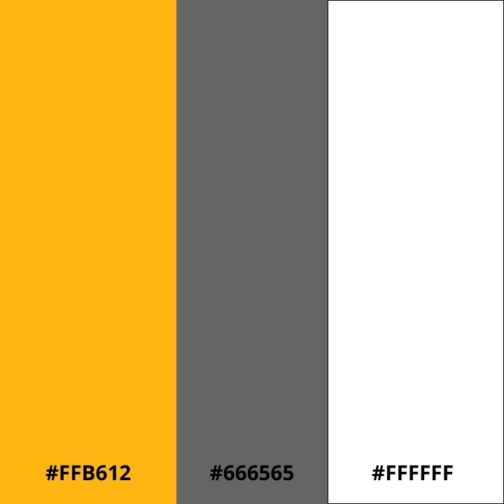

# FitByte

Esteja por dentro de como foi construido nosso website altamente escalavel por nossos desenvolvedores.

## Tecnologias Utilizadas

- HTML
- CSS

## Paletas de cores

Quais são as paletas utilizadas por nos?

Respectivamente são, #FFB612, #666565 e #FFFFFF.

## Proposta Layout

A principio, quando entramos no site, nos deparamos com uma imagem de background e apenas uma mensagem despertando nosso maior objetivo, oferecer um serviço com as melhores tecnologias ja produzidas por nós mesmo.  E também um botão de direcionamento para nossos planos para que veja nossas ofertas. O objetivo e sempre oferecer algo simples que possa ser direto a quem esteja navegando, portanto, trabalhamos com apenas informações essenciais e seja direcionada ao cliente. Logo apos temos, outros tipos, como, os planos, contato, nosso time.

Desenvolvido por Victor Santos e Paulo vitor
